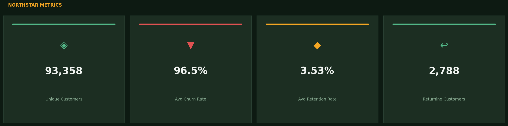
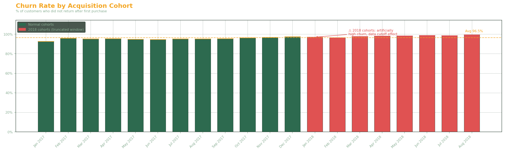
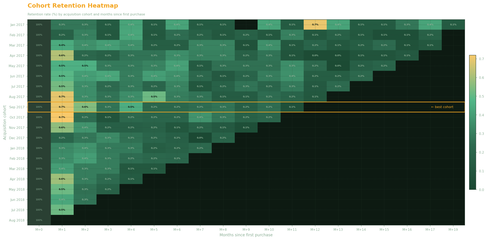
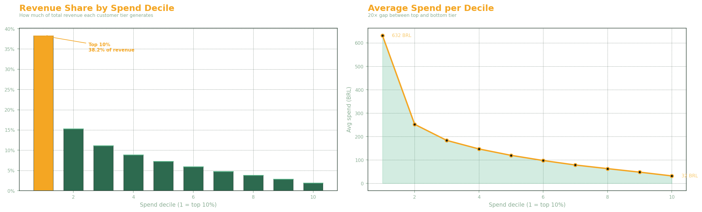
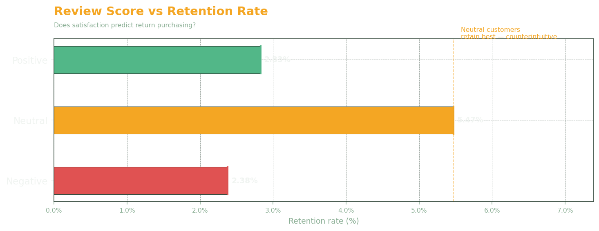

<div align="center">
  
# Olist Customer Retention Analysis
`SQL` `BigQuery` `Python` `Cohort Analysis` `Window Functions`
</div>
<br>

Olist is a Brazilian e-commerce marketplace platform that connects small and medium-sized merchants to major retail channels across Brazil. This analysis looks at 2 years of data across 99,441 transactions with 96,096 customers.

**Core problem :** More than 95% of Olist customers never place a second order. The Head of Growth wants to understand why so few customers come back after their first order. Three questions drove this analysis:
>- Which customer cohorts retain best?
>- How concentrated is revenue across the customer base?
>- Does a customer's review score predict whether they'll return?

<br>
The key insights and recommendations focus on the following areas:<br><br>

- **Metrics** : Churn rate, retention rate, and returning customer volume across the full customer base
- **Cohort Retention** : Month-by-month retention curves to identify which acquisition periods produced the most loyal customers
- **CLV Segmentation** : Spend decile analysis to quantify revenue concentration and prioritise high-value segments
- **Review Score vs. Retention** : Whether customer satisfaction scores predict the likelihood of returning

---
<details>
<summary><b>🔧 Methodology, tools & data quality</b></summary>
<br>
  
## Methodology
- **Cohort analysis** : each customer is assigned to their first purchase month and tracked over time
- **Retention matrix** : monthly retention rates per cohort using `DATE_DIFF` and chained CTEs
- **Churn rate** : percentage of customers who never returned after month 0
- **CLV segmentation** : customers ranked and split into deciles by total spend
- **Review score vs retention** : joining orders, customers, and reviews to test whether satisfaction predicts churn

## Skills & Tools
- **SQL:** CTEs, window functions (`RANK()`, `NTILE()`, `SUM() OVER()`), `DATE_TRUNC`, `DATE_DIFF`, `COUNTIF`, multi-table joins, `HAVING`, subqueries
- **BigQuery:** cloud data warehouse, CSV export
- **Data quality:** null checks, duplicate detection, type casting, anomaly identification

## Dataset
**Source:** [Olist Brazilian E-commerce — Kaggle](https://www.kaggle.com/datasets/olistbr/brazilian-ecommerce)

Real transactional data from Olist covering September 2016 to October 2018. 9 tables including orders, customers, payments, reviews, products, and sellers.

## Data Quality Notes
- `customer_id` is tied to each order, not to the person — all retention analysis uses `customer_unique_id` to correctly track returning customers
- 2,965 orders have no delivery date — these are non-delivered orders (cancelled, in transit) and are excluded via `WHERE order_status = 'delivered'`
- September and December 2016 each have only 1 order, excluded from cohort analysis
- 2016 data overall excluded due to incomplete coverage

</details>

---
 
## Northstar Metrics
 

 
---

## Executive Summary
 

 
<table>
<tr>
<td width="50%" valign="top">

**1. Over 95% of customers never come back**<br>
Churn exceeds 95% across all cohorts. This is not a seasonal anomaly or a single underperforming period, it is a structural characteristic of the customer base. The vast majority of Olist customers make a single purchase and do not return, regardless of when they were acquired or what they bought.

**2. The top 10% of customers generate 38% of revenue**<br>
The top 10% of customers by spend account for 38% of total revenue, with an average spend of 632 BRL compared to just 32 BRL for the bottom 10%. This 20x gap means a small number of customers carry a disproportionate share of the business. Losing even a fraction of this segment has an outsized revenue impact.

</td>
<td width="50%" valign="top">

**3. Older cohorts retain better**<br>
The January 2017 cohort has a 7.25% retention rate, still far below healthy benchmarks, but notably ahead of later cohorts. Part of this is because they had more time to return before the data ends, but it also shows that long-term reengagement can work.

**4. Unhappy customers churn the most**<br>
Neutral customers (score 3) retain at 5.47%, outperforming both negative (2.38%) and positive (2.83%) segments. This counterintuitive result suggests that repeat purchasing on Olist is not primarily driven by satisfaction, it may be driven more by price, product availability, or lack of alternatives.

</td>
</tr>
</table>

---

## Insights & Recommendations
 
<details>
<summary><b>Best cohorts retain at 7%</b></summary>
<br>
  

 
- No cohort retains more than ~7% of customers beyond month 0
- The staircase on the right is a data truncation effect: 2018 cohorts had fewer months to return before the dataset ends
- Jan 2017 is the most reliable benchmark: 19 months of observation, 7.25% peak retention
- A 7.25% retention ceiling is structurally weak and signals that no meaningful loyalty mechanism was in place during this period.
<br>

**→** Focus reengagement campaigns on customers acquired 6–12 months ago, when return probability is highest. Use Jan 2017 cohort behaviour as the target baseline.
 <br>

</details>
<details>
<summary><b>96.5% average churn : Olist is a one-purchase platform</b></summary>
<br>
  

 
- 2017 cohorts churn between 90–97%, no improvement trend across the year
- Average churn: **96.5%** —> Olist operates structurally as a one-purchase platform
- Cohorts acquired in late 2017 and 2018 show churn rates that appear even worse than earlier cohorts. These customers had fewer months available to make a return purchase before the dataset cutoff. Their true long-run retention is likely consistent with earlier cohorts, not worse.

<br>

**→** A post-purchase email sequence at 30, 60, and 90 days is the highest-leverage intervention. A 1% retention lift across 96,000 customers = ~960 more returning buyers.
 <br>

</details>
<details>
<summary><b>Top 10% of customers = 38% of revenue</b></summary>
<br>
  

 
- Top decile generates **38.2% of revenue** with 632 BRL avg spend vs 32 BRL for the bottom decile
- The curve drops sharply after decile 1 and deciles 2–4 are the most actionable upgrade target
- Bottom 5 deciles represent half the customer base but a small fraction of revenue
- This concentration creates both a risk and an opportunity: retaining top-decile customers has an outsized effect on revenue, while acquiring more customers who match their profile would be disproportionately valuable.
<br>

**→** Build a VIP programme for decile 1 (free shipping, priority support, early access) to protect 38% of revenue. Run upgrade campaigns for deciles 2–4, they already spend meaningfully. Nudge them toward the decide 1 behaviour. 
 <br>

</details>
<details>
<summary><b>Neutral customers retain better than satisfied ones</b></summary>
<br>
  

 
- Neutral customers (score 3) retain at **5.47%**
- Positive reviewers retain at 2.83%, below neutral, likely because satisfied customers felt no unresolved reason to return
- Negative reviewers churn most at 2.38%
<br>

**→** Investing heavily in review score programmes to drive retention is likely misdirected. Focus retention on behavioural signals: repeat category interest, time since last order.
<br>

**→** The 5.47% retention rate among score-3 customers is the highest observed. Understanding who these customers are, what categories they buy, and how they differ from positive reviewers could inform a more effective retention targeting model.

<br>

 
</details>


---

## Limitations & Next Steps
**Limitations:**
- 2018 cohorts have artificially low retention rates, the data ends in October 2018, so recent customers simply didn't have time to come back. 
- No demographic data available, we can't segment retention by age, location, or acquisition channel
- The current dataset captures whether a customer returned, but not why they didn't. Adding exit intent signals, category browse data, or cart abandonment tracking would significantly improve the ability to intervene at the right.

**Next steps:**
- Build a churn prediction model using review score, order value, product category, and delivery time as features
- Look at delivery time vs retention : does a late delivery predict churn?
- Build a live retention heatmap for the Growth team

---

## Repository Structure
```
├── ingestion/
│   ├── ingestion.py               # Loads Olist data into BigQuery
│   └── requirements.txt           # Python dependencies
├── queries/
│   ├── 01_data_quality.sql        # Row counts, null checks, duplicates
│   ├── 02_revenue_trend.sql       # Monthly revenue and order volume
│   ├── 03_cohort_assignment.sql   # Cohort size per month
│   ├── 04_retention_matrix.sql    # Monthly retention rates by cohort
│   ├── 05_churn_rate.sql          # Churn rate per cohort
│   ├── 06_clv_ranking.sql         # CLV segmentation by decile
│   └── 07_review_vs_retention.sql # Review score vs retention rate
├── outputs/
│   └── retention_matrix.csv       # Exported for visualization
└── README.md
```

## How to Run
1. `pip install -r ingestion/requirements.txt`
2. Add your GCP key to `ingestion/credentials/gcp-key.json`
3. `python ingestion/ingestion.py`
4. Run queries in BigQuery
